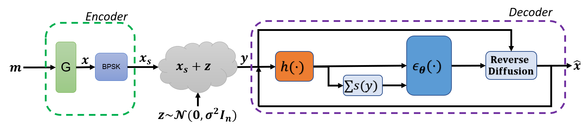

# Denoising Diffusion Error Correction Codes

Implementation of [Denoising Diffusion Error Correction Codes (ICLR 2023)](https://arxiv.org/abs/2209.13533).

## Abstract
Error correction code (ECC) is an integral part of the physical communication
layer, ensuring reliable data transfer over noisy channels. Recently, neural decoders have demonstrated their advantage over classical decoding techniques.
However, recent state-of-the-art neural decoders suffer from high complexity and
lack the important iterative scheme characteristic of many legacy decoders. In this
work, we propose to employ denoising diffusion models for the soft decoding of
linear codes at arbitrary block lengths. Our framework models the forward channel corruption as a series of diffusion steps that can be reversed iteratively. Three
contributions are made: (i) a diffusion process suitable for the decoding setting is
introduced, (ii) the neural diffusion decoder is conditioned on the number of parity errors, which indicates the level of corruption at a given step, (iii) a line search
procedure based on the code’s syndrome obtains the optimal reverse diffusion step
size. The proposed approach demonstrates the power of diffusion models for ECC
and is able to achieve state of the art accuracy, outperforming the other neural decoders by sizable margins, even for a single reverse diffusion step.

## Install
- Pytorch

## Script
Use the following command to train, on GPU 0, a 6 layers ECCT of dimension 32 on the POLAR(64,32) code:

`python Main.py --gpu=0 --N_dec=6 --d_model=32 --code_type=POLAR --code_n=64 --code_k=32`
      
## Reference
    @article{choukroun2022denoising,
      title={Denoising Diffusion Error Correction Codes},
      author={Choukroun, Yoni and Wolf, Lior},
      journal={arXiv preprint arXiv:2209.13533},
      year={2022}
    }

## License
This repo is MIT licensed.
